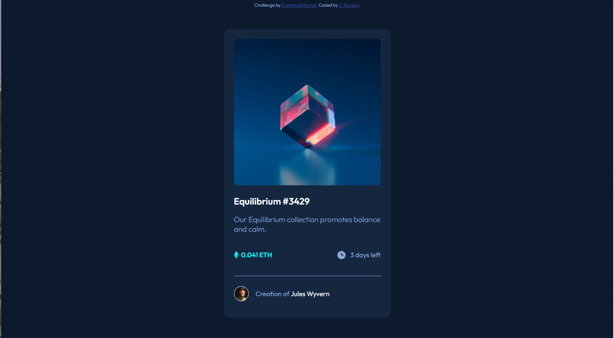

# Frontend Mentor - NFT preview card component solution

This is a solution to the [NFT preview card component challenge on Frontend Mentor](https://www.frontendmentor.io/challenges/nft-preview-card-component-SbdUL_w0U). Frontend Mentor challenges help you improve your coding skills by building realistic projects. 

## Table of contents

- [Overview](#overview)
  - [The challenge](#the-challenge)
  - [Screenshot](#screenshot)
  - [Links](#links)
- [My process](#my-process)
  - [Built with](#built-with)
  - [What I learned](#what-i-learned)
  - [Useful resources](#useful-resources)
- [Author](#author)

## Overview

### The challenge

Users should be able to:

- View the optimal layout depending on their device's screen size
- See hover states for interactive elements

### Screenshot

### Links

- Solution URL: [Add solution URL here](https://your-solution-url.com)
- Live Site URL: [Add live site URL here](https://your-live-site-url.com)

## My process

### Built with

- Semantic HTML5 markup
- CSS custom properties
- Flexbox
- Mobile-first workflow

### What I learned

In this project I learned how to do the image overlays.  This part took some research, I attempted it before in another project and ended up giving up and changing my design but I was determined this time and finally found the right resources to help me understand it and explain it well enough. (This is linked in the resources section too.) It was suprisingly easy once I had it explained out to me, and I should be able to recreate this myself next time with less help. I am also getting more comfortable in creating my layouts.  The layout in this challenge came easier than the last couple, and without as much struggle to get everything the way I wanted. 

### Useful resources

- Image Hover Text Overlay Effect with HTML & CSS - Web Design Tutorial:
  https://www.youtube.com/watch?v=exb2ab72Xhs 
  This helped me with adding the overlay for the image hover. I looked at quite a few written articles first, but none of them were written in ways that I was grasping so I turned to YouTube and came across this.  His example was almost exactly what I needed (replacing the text with the eye image) and he explained as he went what he was putting each property in there for.  

## Author

- Frontend Mentor - [@jenmurph4610](https://www.frontendmentor.io/profile/jenmurph4610)
- GitHub - [@jenmurph4610](https://github.com/jenmurph4610)
